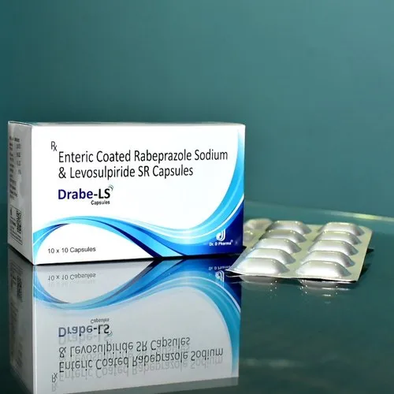

# Project Responsive Web Design using Bootstrap
## Date:

## AIM:
To design a responsive website for a Pharmaceutical Company using Bootstrap.

## DESIGN STEPS:

### Step 1:
Clone the repository from GitHub.

### Step 2:
Create Django Admin project.

### Step 3:
Create a New App under the Django Admin project.

### Step 4:
Insert the necessary CSS and JavaScript files as external in order to use Bootstrap.

### Step 5:
Create a HTML file and include the needed Bootstrap components.

### Step 6:
Publish the website in the LocalHost.

## PROGRAM :
<!DOCTYPE html>
<html lang="en">
<head>
  <meta charset="UTF-8">
  <meta name="viewport" content="width=device-width, initial-scale=1.0">
  <title style="font-family:'Franklin Gothic Medium', 'Arial Narrow', Arial, sans-serif;">Home -Pharmaceutical Company </title>
  <link href="https://stackpath.bootstrapcdn.com/bootstrap/4.5.2/css/bootstrap.min.css" rel="stylesheet">
  
</head>
<body style="background-color: rgb(121, 172, 92);">
  <nav class="navbar navbar-expand-lg navbar-dark bg-primary">
    <a class="navbar-brand" href="#" style="font-family:'Franklin Gothic Medium', 'Arial Narrow', Arial, sans-serif;">Pharmaceutical Company</a>
    <button class="navbar-toggler" type="button" data-toggle="collapse" data-target="#navbarSupportedContent" aria-controls="navbarSupportedContent" aria-expanded="false" aria-label="Toggle navigation">
      
    </button>
    

      <ul class="navbar-nav mr-auto">
        <li class="nav-item active">
          <a class="nav-link" href="web.html" style="font-family:'Franklin Gothic Medium', 'Arial Narrow', Arial, sans-serif;">HOME (current)</a>
        </li>
        <li class="nav-item">
          <a class="nav-link" href="about.html" style="font-family:'Franklin Gothic Medium', 'Arial Narrow', Arial, sans-serif;">ABOUT</a>
        </li>
        <li class="nav-item">
          <a class="nav-link" href="product.html" style="font-family:'Franklin Gothic Medium', 'Arial Narrow', Arial, sans-serif;">PRODUCTS</a>
        </li>
        <li class="nav-item">
          <a class="nav-link" href="contact.html" style="font-family:'Franklin Gothic Medium', 'Arial Narrow', Arial, sans-serif;">CONTACT</a>
        </li>
      </ul>
      <ul class="navbar-nav ml-auto">
        <li class="nav-item">
          <a class="nav-link" href="#" style="font-family:'Franklin Gothic Medium', 'Arial Narrow', Arial, sans-serif;">LOGIN</a>
        </li>
        <li class="nav-item">
          <a class="nav-link" href="#" style="font-family:'Franklin Gothic Medium', 'Arial Narrow', Arial, sans-serif;">REGISTER</a>
        </li>
      </ul>
    

  </nav>
  

    

      

        <h1 style="font-family:'Franklin Gothic Medium', 'Arial Narrow', Arial, sans-serif;">Welcome to Pharmaceutical Company</h1>
        
Welcome to Pharmaceutical Company, your trusted source for high-quality pharmaceutical products. We are dedicated to improving the health and well-being of our customers by providing safe and effective medications.

        
At Pharmaceutical Company, we offer a wide range of prescription and over-the-counter medications to meet your healthcare needs. Whether you're managing a chronic condition or simply looking for relief from minor ailments, we have the products you need.

        
In addition to medications, we also carry a variety of healthcare products and accessories, including vitamins, supplements, first aid supplies, and more. Our knowledgeable staff is here to assist you with any questions you may have and to ensure you find the right products for your needs.

        
Thank you for choosing Pharmaceutical Company for your healthcare needs. We look forward to serving you and helping you live a healthier life.

      

      

        
      

    

  

  <body >
  <footer class="bg-dark text-white text-center py-4 mt-5">
    
&copy; 2024 Pharmaceutical Company. All rights reserved. BY PREETHI B(212221220040)

  </footer>
  
  
  
</body>
</html>
<!DOCTYPE html>
<html lang="en">
<head>
  <meta charset="UTF-8">
  <meta name="viewport" content="width=device-width, initial-scale=1.0">
  <title style="font-family:'Franklin Gothic Medium', 'Arial Narrow', Arial, sans-serif;">ABOUT Pharmaceutical Company</title>
  <link href="https://stackpath.bootstrapcdn.com/bootstrap/4.5.2/css/bootstrap.min.css" rel="stylesheet">
</head>
<body>
  <nav class="navbar navbar-expand-lg navbar-dark bg-primary">
    <a class="navbar-brand" href="#" style="font-family:'Franklin Gothic Medium', 'Arial Narrow', Arial, sans-serif;">Pharmaceutical Company</a>
    <button class="navbar-toggler" type="button" data-toggle="collapse" data-target="#navbarSupportedContent" aria-controls="navbarSupportedContent" aria-expanded="false" aria-label="Toggle navigation">
      
    </button>
    

      <ul class="navbar-nav mr-auto">
        <li class="nav-item">
          <a class="nav-link" href="web.html" style="font-family:'Franklin Gothic Medium', 'Arial Narrow', Arial, sans-serif;">HOME</a>
        </li>
        <li class="nav-item dropdown active">
          <a class="nav-link dropdown-toggle" href="about.html" id="navbarDropdownAbout" role="button" data-toggle="dropdown" aria-haspopup="true" aria-expanded="false" style="font-family:'Franklin Gothic Medium', 'Arial Narrow', Arial, sans-serif;">
            ABOUT
          </a>
          

            <a class="dropdown-item" href="#vision" style="font-family:'Franklin Gothic Medium', 'Arial Narrow', Arial, sans-serif;">Vision</a>
            <a class="dropdown-item" href="#mission" style="font-family:'Franklin Gothic Medium', 'Arial Narrow', Arial, sans-serif;">Mission</a>
            <a class="dropdown-item" href="#values" style="font-family:'Franklin Gothic Medium', 'Arial Narrow', Arial, sans-serif;">Values</a>
          

        </li>
        <li class="nav-item">
          <a class="nav-link" href="product.html" style="font-family:'Franklin Gothic Medium', 'Arial Narrow', Arial, sans-serif;">PRODUCTS</a>
        </li>
        <li class="nav-item">
          <a class="nav-link" href="#" style="font-family:'Franklin Gothic Medium', 'Arial Narrow', Arial, sans-serif;">CONTACT</a>
        </li>
      </ul>
    

  </nav>
  

    

      

        <h1 style="font-family:'Franklin Gothic Medium', 'Arial Narrow', Arial, sans-serif;">ABOUT Pharmaceutical Company</h1>
        

          <h2 style="font-family:'Franklin Gothic Medium', 'Arial Narrow', Arial, sans-serif;">Vision</h2>
          
Our vision is to be a leading provider of innovative healthcare solutions that improve the quality of life for people around the world.

        

        

          <h2 style="font-family:'Franklin Gothic Medium', 'Arial Narrow', Arial, sans-serif;">Mission</h2>
          
Our mission is to develop and deliver safe, effective, and affordable medications that address the healthcare needs of our customers.

        

        

          <h2 style="font-family:'Franklin Gothic Medium', 'Arial Narrow', Arial, sans-serif;">Values</h2>
          <ul style="font-family:'Franklin Gothic Medium', 'Arial Narrow', Arial, sans-serif;">
            <li>-> Quality: We are committed to maintaining the highest standards of quality in everything we do.</li>
            <li>-> Integrity: We conduct our business with honesty, transparency, and ethical behavior.</li>
            <li>-> Innovation: We strive to continuously innovate and improve our products and services to better serve our customers.</li>
            <li>-> Customer Focus: We are dedicated to understanding and meeting the needs of our customers.</li>
            <li>-> Teamwork: We work together as a team to achieve our goals and deliver exceptional results.</li>
          </ul>
        

      

    

  

  <body background="image/a.jpg" style="background-repeat: no-repeat; background-size: cover;">
  <footer class="bg-dark text-white text-center py-2 mt-2">

  <body background="a.png" style="background-repeat: no-repeat; background-size: cover;">
    
&copy; 2024 Pharmaceutical Company. All rights reserved.  BY PREETHI B (212221220040)

  </footer>
  
  
  
</body>
</html >
<!DOCTYPE html>
<html lang="en">
<head>
  <meta charset="UTF-8">
  <meta name="viewport" content="width=device-width, initial-scale=1.0">
  <title style="font-family:'Franklin Gothic Medium', 'Arial Narrow', Arial, sans-serif;">Products - Pharmaceutical Company</title>
  <link href="https://stackpath.bootstrapcdn.com/bootstrap/4.5.2/css/bootstrap.min.css" rel="stylesheet">
</head>
<body>
  <nav class="navbar navbar-expand-lg navbar-dark bg-primary">
    <a class="navbar-brand" href="#" style="font-family:'Franklin Gothic Medium', 'Arial Narrow', Arial, sans-serif;">Pharmaceutical Company</a>
    <button class="navbar-toggler" type="button" data-toggle="collapse" data-target="#navbarSupportedContent" aria-controls="navbarSupportedContent" aria-expanded="false" aria-label="Toggle navigation">
      
    </button>
    

      <ul class="navbar-nav mr-auto">
        <li class="nav-item">
          <a class="nav-link" href="web.html" style="font-family:'Franklin Gothic Medium', 'Arial Narrow', Arial, sans-serif;">HOME</a>
        </li>
        <li class="nav-item">
          <a class="nav-link" href="about.html" style="font-family:'Franklin Gothic Medium', 'Arial Narrow', Arial, sans-serif;">ABOUT</a>
        </li>
        <li class="nav-item active">
          <a class="nav-link" href="product.html" style="font-family:'Franklin Gothic Medium', 'Arial Narrow', Arial, sans-serif;">PRODUCTS (current)</a>
        </li>
        <li class="nav-item">
          <a class="nav-link" href="contact.html" style="font-family:'Franklin Gothic Medium', 'Arial Narrow', Arial, sans-serif;">CONTACT</a>
        </li>
      </ul>
      <ul class="navbar-nav ml-auto">
        <li class="nav-item">
          <a class="nav-link" href="#" style="font-family:'Franklin Gothic Medium', 'Arial Narrow', Arial, sans-serif;">LOGIN</a>
        </li>
        <li class="nav-item">
          <a class="nav-link" href="#" style="font-family:'Franklin Gothic Medium', 'Arial Narrow', Arial, sans-serif;">REGISTER</a>
        </li>
      </ul>
    

  </nav>
  

    

      

        <h1 style="font-family:'Franklin Gothic Medium', 'Arial Narrow', Arial, sans-serif;">OUR PRODUCTS</h1>
        

          

            
            

              <h5 class="card-title" style="font-family:'Franklin Gothic Medium', 'Arial Narrow', Arial, sans-serif;">PRODUCT 1</h5>
              
Missionpharma - Generic pharmaceuticals and medical consumables.

              <a href="#" class="btn btn-primary" style="font-family:'Franklin Gothic Medium', 'Arial Narrow', Arial, sans-serif;">Buy Now</a>
            

          

          

            
            

              <h5 class="card-title" style="font-family:'Franklin Gothic Medium', 'Arial Narrow', Arial, sans-serif;">PRODUCT 2</h5>
              
Thiamine Tablets Benztrophine Mesylate Tablets Pyridoxine Tablets.

              <a href="#" class="btn btn-primary" style="font-family:'Franklin Gothic Medium', 'Arial Narrow', Arial, sans-serif;">Buy Now</a>
            

          

          

            
            

              <h5 class="card-title" style="font-family:'Franklin Gothic Medium', 'Arial Narrow', Arial, sans-serif;">PRODUCT 3</h5>
              
Enteric coated rabeprazole sodium levosulpiride sr capsules.

              <a href="#" class="btn btn-primary" style="font-family:'Franklin Gothic Medium', 'Arial Narrow', Arial, sans-serif;">Buy Now</a>
            

          

        

      

    

  

  <footer class="bg-dark text-white text-center py-2 mt-2">
    
&copy; 2024 Pharmaceutical Company. All rights reserved.  BY PREETHI B (212221220040)

  </footer>
  <body background="a.png" style="background-repeat: no-repeat; background-size: cover;">
  
  
  
</body>
</html>
<!DOCTYPE html>
<html lang="en">
<head>
  <meta charset="UTF-8">
  <meta name="viewport" content="width=device-width, initial-scale=1.0">
  <title style="font-family:'Franklin Gothic Medium', 'Arial Narrow', Arial, sans-serif;">Contact Us - Pharmaceutical Company </title>
  <link href="https://stackpath.bootstrapcdn.com/bootstrap/4.5.2/css/bootstrap.min.css" rel="stylesheet">
</head>
<body>
  <nav class="navbar navbar-expand-lg navbar-dark bg-primary">
    <a class="navbar-brand" href="#" style="font-family:'Franklin Gothic Medium', 'Arial Narrow', Arial, sans-serif;">Pharmaceutical Company</a>
    <button class="navbar-toggler" type="button" data-toggle="collapse" data-target="#navbarSupportedContent" aria-controls="navbarSupportedContent" aria-expanded="false" aria-label="Toggle navigation">
      
    </button>
    

      <ul class="navbar-nav mr-auto">
        <li class="nav-item">
          <a class="nav-link" href="web.html" style="font-family:'Franklin Gothic Medium', 'Arial Narrow', Arial, sans-serif;">HOME</a>
        </li>
        <li class="nav-item">
          <a class="nav-link" href="about.html" style="font-family:'Franklin Gothic Medium', 'Arial Narrow', Arial, sans-serif;">ABOUT</a>
        </li>
        <li class="nav-item">
          <a class="nav-link" href="product.html" style="font-family:'Franklin Gothic Medium', 'Arial Narrow', Arial, sans-serif;">PRODUCTS</a>
        </li>
        <li class="nav-item active">
          <a class="nav-link" href="contact.html" style="font-family:'Franklin Gothic Medium', 'Arial Narrow', Arial, sans-serif;">CONTACT (current)</a>
        </li>
      </ul>
    

  </nav>
  

    

      

        <h1 style="font-family:'Franklin Gothic Medium', 'Arial Narrow', Arial, sans-serif;">CONTACT US</h1>
        
For any inquiries or feedback, please fill out the form below and we will get back to you as soon as possible.

        <form>
          

            <label for="name" style="font-family:'Franklin Gothic Medium', 'Arial Narrow', Arial, sans-serif;">YOUR NAME</label>
            <input type="text" class="form-control" id="name" placeholder="Enter your name">
          

          

            <label for="email" style="font-family:'Franklin Gothic Medium', 'Arial Narrow', Arial, sans-serif;">YOUR EMAIL</label>
            <input type="email" class="form-control" id="email" placeholder="Enter your email">
          

          

            <label for="message" style="font-family:'Franklin Gothic Medium', 'Arial Narrow', Arial, sans-serif;">MESSAGE</label>
            <textarea class="form-control" id="message" rows="5" placeholder="Enter your message"></textarea>
          

          <button type="submit" class="btn btn-primary" style="font-family:'Franklin Gothic Medium', 'Arial Narrow', Arial, sans-serif;">SUBMIT</button>
        </form>
      

      

        <h2 style="font-family:'Franklin Gothic Medium', 'Arial Narrow', Arial, sans-serif;">Pharmaceutical Company </h2>
        <address>
          <strong style="font-family:'Franklin Gothic Medium', 'Arial Narrow', Arial, sans-serif;">Address:</strong> 
          Saveetha Nagar,Thandalam,Kancheepuram.  
          <strong style="font-family:'Franklin Gothic Medium', 'Arial Narrow', Arial, sans-serif;">Email:</strong> 
          info@Pharmaceutical Company .com  
          <strong style="font-family:'Franklin Gothic Medium', 'Arial Narrow', Arial, sans-serif;">Phone:</strong> 
          +9894359852
        </address>
      

    

  

  <body background="image/a.jpg" style="background-repeat: no-repeat; background-size: cover;">
  <footer class="bg-dark text-white text-center py-2 mt-2">
    
&copy; 2024 Pharmaceutical Company. All rights reserved.  BY PREETHI B (212221220040)

  </footer>
  
  
  
</body>
</html>

## OUTPUT:

## RESULT:
The Project for responsive web design using Bootstrap is completed successfully.
